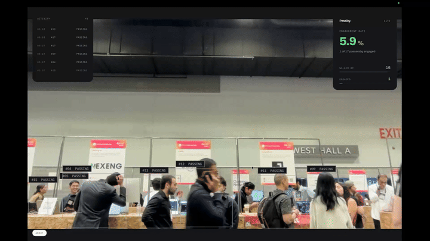
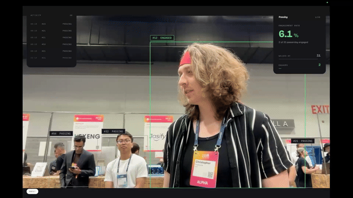
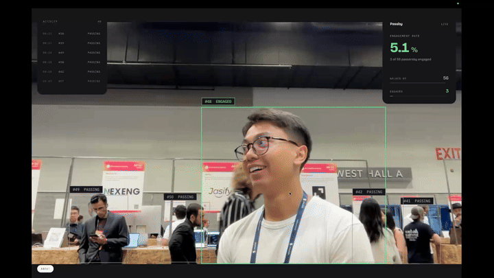

<div align="center">
  
  <h1>👁️ PassBy Analytics</h1>
  <p><strong>Transform any laptop into a smart booth engagement tracker.</strong></p>
  <p><i>Built for Hackathons. Powered by Edge AI. 100% Privacy-Preserving.</i></p>
  
  <p>
    <strong><a href="https://metroxe.github.io/websummit-hackathon/">🔴 Try the Live Demo</a></strong> | 
    <strong><a href="https://youtu.be/Lt1G3LELPd8">📺 Watch the Presentation</a></strong>
  </p>

  [](https://reactjs.org/)
  [](https://vitejs.dev/)
  [](https://www.typescriptlang.org/)
  [](https://developers.google.com/mediapipe)

  <br />
  <br />

  
</div>

<br />

## 🚀 The Pitch

Have you ever run a booth at a conference or hackathon and wondered: *"How many people actually stopped and talked to us versus just walking by?"* 

Enter **PassBy Analytics**. 

PassBy is a lightweight, zero-setup computer vision application. You open a website on your laptop, point your webcam at the crowd, and our Edge AI instantly categorizes the crowd into **Passersby** and **Engaged Leads** based on *mouth movement*. If they are talking and asking questions, you'll know!

<div align="center">
  
</div>

## ✨ Features That Wow

*   **🗣️ Lip-Reading Engagement:** We don't just track bodies. We use Google's `FaceLandmarker` 468-point 3D face mesh to track the exact vertical distance between the upper and lower lips. If someone's mouth is moving, we instantly flag them as an active, engaged lead!
*   **⚡ Blazing Fast Edge AI:** Runs two simultaneous ML models (`EfficientDet-Lite0` for bodies + `FaceLandmarker` for lips) directly in your browser using WebAssembly. No cloud APIs. No latency.
*   **🔒 Absolute Privacy:** Because the AI runs entirely in the browser's memory, no images or video feeds are *ever* sent to a server. What happens at the booth stays at the booth.
*   **🎯 Zero Hardware:** Forget expensive LiDAR sensors or infrared cameras. If you have a laptop with a webcam, you have a smart analytics dashboard.

<br />

<div align="center">
  
</div>

## 🛠️ How We Built It Under The Hood

The secret sauce is in how we combine tracking and facial landmarks:
1.  **Body Tracking:** We draw a bounding box around everyone in frame.
2.  **Facial Correlation:** We detect faces and calculate an algorithmic `mouthOpenness` score (distance between lips divided by face height, ensuring accuracy from 1 foot or 10 feet away).
3.  **State Management:** We map the Face ID back to the Body ID using bounding-box intersection. If the `mouthOpenness` score rapidly fluctuates above `0.05` for 5 consecutive frames, our categorizer promotes that person from `PASSING` to `ENGAGED`.


## 💻 Run It Locally (In 60 Seconds)

You want to see the magic yourself? It's plug-and-play.

```bash
# 1. Clone the repo
git clone https://github.com/Metroxe/websummit-hackathon.git
cd websummit-hackathon

# 2. Install Dependencies
npm install

# 3. Start the Vite Dev Server
npm run dev
```

Open `http://localhost:5173/websummit-hackathon/` in your browser. Allow webcam access. Stand in front of the camera, and start talking!

---

<div align="center">
  <p><i>Built with ☕ and ❤️ at the Web Summit Hackathon.</i></p>
</div>
